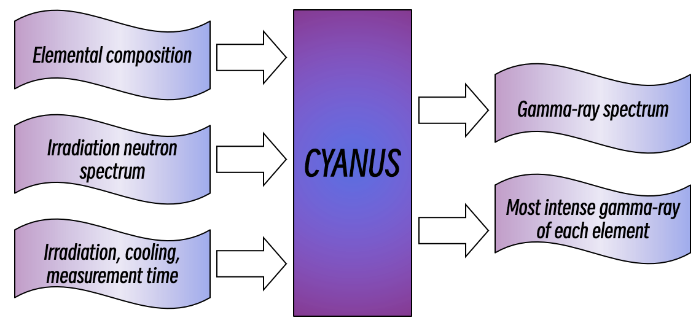
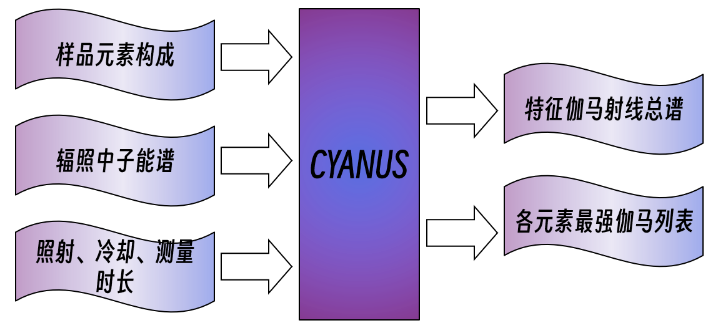

======
  

CYANUS (a Calculator for Yield Analysis of NeUtron Activation) is a MATLAB tool for calculating the energies and intensities of delayed gamma-rays released by neutron irradiated samples. 

CYANUS allows the user to arbitrarily designate the pointwised neutorn spectrum, elemental composition of the irradiation sample and the three key time duration (irradiation, cooling and measurement time). 

## Highlight
1. Pointwised neutron spectra are avaliable.
2. The isomer production ratios for isotopes irradiated by neutrons with different energies are taken into consideration.
3. Easy to deploy, add the folder to the MATLAB path, then start the work.

## Quick start
1. Add the folder `function` to MATLAB search path.
2. Run `cyanus()` in the command window, several input forms to run CYANUS will appear. 
3. Results are saved to `cyanus-output.mat` in the working path. The variable `table_gamma` shows all the possible delayed gamma-rays and their count in the measurement time period.

## Physical priciple
When irradiated by neutrons, the stable isotope $^AX$ may capture a neutron and form the isotope $^{A+1,s}X$ ($s$ represents the long lived state, $g$ for ground state, $m1$ for the first isomer and $m2$ for the second isomer). The production rate is

$$
\frac{dN}{dt}=N_0R_{I,s}\int\sigma(E)\phi(E)dE-\lambda N
$$

In which
    $N$ = The number of $^{A+1,s}X$ in the sample
    $N_0$ = The number of $^AX$ in the sample
    $R_{I,s}$ = The isomeric ratio (the probability of producing isomer $^{A+1,s}X$ after $^AX$ absorbs a neutron). It is also used for standing for the ratio to form the ground state nucleus, which is definitely not an isomer, for the convenience.
    $\sigma(E)$ = The (n, γ) cross section of $^AX$ for neutrons with energy  
    $\phi(E)$ = The flux of irradiating neutrons with energy from $E$ to $E+dE$
    $\lambda$ = The decay constant of $^{A+1,s}X$

After an irradiation time of $t_{irr}$ , the amount of the radioactive isotopes $^{A+1,s}X$ will be 

$$
N(t=t_{irr}) = \frac{N_0R_{I,s}\int\sigma(E)\phi(E)dE}{\lambda} (1-e^{-\lambda t_{irr}})
$$

The count $C_{\gamma}$ of gamma-ray with energy $E_{\gamma}$ released by $^{A+1,s}X$ during the time period [$t_{cool}$ , $t_{cool}+t_{meas}$ ] after the irradiation could be calculated as

$$
C_{\gamma}=N(t=t_{irr})\Gamma_{\gamma}e^{-\lambda t_{cool}}(1-e^{-\lambda t_{meas}})
$$

In which
    $\Gamma_{\gamma}$ = the intensity of gamma-ray with energy of $E_\gamma$ along with the decay of a $^{A+1,s}X$

CYANUS integrated above mentioned equations for calculating $C_{\gamma}$ for all 5730 gamma-rays released by 289 stable isotopes (74 stable elements). For each of the gamma-ray, following table lists the 9 parameters needs to be defined and their source. 

| Symbol | Description | Source |
|-------|-------|--------|
| $N_0$ | The number of $^AX$ in the sample | User input |
| $R_{I,s}$ | The isomeric ratio | Calculated by [TALYS 1.96](https://tendl.web.psi.ch/tendl_2021/talys.html) |
| $\sigma(E)$ | The (n, γ) cross section of $^AX$ for neutrons with energy | [ENDF/B-VII.1](https://www-nds.iaea.org/exfor/endf.htm) |
| $\phi(E)$ | The flux of irradiating neutrons with energy from $E$ to $E+dE$ | User input |
| $\lambda$ | The decay constant of $^{A+1,s}X$ | [NUBASE2020](https://www-nds.iaea.org/relnsd/nubase/nubase_min.html) |
| $\Gamma_{\gamma}$ | The intensity of gamma-ray with energy of $E_\gamma$ along with the decay of a $^{A+1,s}X$ | [Lund/LBNL Nuclear Data Search](http://nucleardata.nuclear.lu.se/toi/nucSearch.asp) |
| $t_{irr}$ | The irradiation time | User input |
| $t_{cool}$ | The cooling time | User input |
| $t_{meas}$ | The measurement time | User input |

The nuclear data from the databases were downloaded and organized in the folder `data`

## About CYANUS
As an elementary work for aiding the neutron activation analysis with complex neutron fields, CYANUS requires abundant tests to become reliable. We sincerely thank you for using and cross checking CYANUS. Any comments are welcome.

中子活化特征伽马射线计算程序CYANUS
====

CYANUS 是一个使用MATLAB编写的小工具，用以计算中子活化后，样品发射的缓发伽马射线能量及强度。用户可自由输入样品元素组成、辐照中子能谱、照射时长、冷却时长和测量时长，程序将基于核数据，计算并输出辐照后的物体释放的所有的缓发伽马射线能量和数量信息。

## 亮点
+ 中子能谱输入自由度更高，可逐能量点指定注量率，而不局限于传统的热中子注量率、快热中子比等若干个参数;
+ 考虑了同质异能素的生成概率与中子能量的依赖关系；
+ 快速部署，只需将`function`目录加入MATLAB搜索路径，即可使用，便于与其它科研代码互相调用和组合。

## 快速开始

1. 将文件夹 `function` 加入MATLAB自动搜索路径
2. 在命令行窗口运行 `cyanus()` ，提示输入格式
3. 计算结果保存在当前目录下的 `cyanus-output.mat` 文件中，其中 各变量的含义如下表

|变量名|解释|
|----|----|
| spec_neutron | 用户输入的逐能点中子能谱 |
| table_active | 中子照射后各核素到达不同的同质异能素的概率 |
| table_decay | 中子照射产生的各活化核的半衰期及饱和数量 |
| table_element | 元素与质量表格 |
| table_gamma | 受照射的元素发射的所有伽马射线各自的能量和数量 |
| table_gamma_element | 受照射的元素各自发射的所有伽马射线总数量 |
| table_gamma_element_max | 受照射的元素各自发射的最强伽马射线总数量 |
| table_isotope | 用户输入的元素按照天然丰度换算出的核素与对应摩尔数表格 |
| table_specimen | 用户输入的元素与质量表格 |
| ttt | 用户输入的照射、冷却、测量时长 |

## 物理过程和计算原理

中子照射后，稳定核素 $^AX$ 可能俘获一个中子生成 $^{A+1,s}X$ ($s$ 代表长寿命的态, 例如基态$g$ ,第一激发态 $m1$ 和第二激发态 $m2$ ). $^{A+1,s}X$的产生速率可以表示为

$$
\frac{dN}{dt}=N_0R_{I,s}\int\sigma(E)\phi(E)dE-\lambda N
$$

其中
    $N$ = 核素 $^{A+1,s}X$ 的数目
    $N_0$ = 核素 $^AX$ 的数目
    $R_{I,s}$ = 核素 $^AX$ 俘获一个中子后，生成 $^{A+1,s}X$ 的概率
    $\sigma(E)$ = 核素 $^AX$ 对于能量为 $E$ 的中子的 (n, γ) 反应截面
    $\phi(E)$ = 能量在 $E$ 至 $E+dE$ 之间的中子注量率
    $\lambda$ = 核素 $^{A+1,s}X$ 的衰变常数

在照射 $t_{irr}$ 秒后, 放射性同位素 $^{A+1,s}X$ 的数量为 

$$
N(t=t_{irr}) = \frac{N_0R_{I,s}\int\sigma(E)\phi(E)dE}{\lambda} (1-e^{-\lambda t_{irr}})
$$

放射性同位素 $^{A+1,s}X$ 释放的能量为 $E_{\gamma}$ 的伽马射线在照射结束后[$t_{cool}$ , $t_{cool}+t_{meas}$ ]时间段内的数量为

$$
C_{\gamma}=N(t=t_{irr})\Gamma_{\gamma}e^{-\lambda t_{cool}}(1-e^{-\lambda t_{meas}})
$$

其中
    $\Gamma_{\gamma}$ = 核素 $^{A+1,s}X$ 释放能量为 $E_{\gamma}$ 的伽马射线的强度

CYANUS 将上述公式整合，计算了 5730个$\gamma$射线的 $C_{\gamma}$ ，它们来自 289 个稳定核素 (74 个稳定元素). 下表展示了公式中各参数的来源。

| 符号 | 解释 | 来源 |
|-------|-------|--------|
| $N_0$ | 核素 $^AX$ 的数目 | 用户输入 |
| $R_{I,s}$ | 核素 $^AX$ 俘获一个中子后，生成 $^{A+1,s}X$ 的概率 | [TALYS 1.96](https://tendl.web.psi.ch/tendl_2021/talys.html) 预先计算|
| $\sigma(E)$ | 核素 $^AX$ 对于能量为 $E$ 的中子的 (n, γ) 反应截面 | [ENDF/B-VII.1](https://www-nds.iaea.org/exfor/endf.htm) |
| $\phi(E)$ | 能量在 $E$ 至 $E+dE$ 之间的中子注量率 | 用户输入 |
| $\lambda$ | 核素 $^{A+1,s}X$ 的衰变常数 | [NUBASE2020](https://www-nds.iaea.org/relnsd/nubase/nubase_min.html) |
| $\Gamma_{\gamma}$ | 核素 $^{A+1,s}X$ 释放能量为 $E_{\gamma}$ 的伽马射线的强度 | [Lund/LBNL Nuclear Data Search](http://nucleardata.nuclear.lu.se/toi/nucSearch.asp) |
| $t_{irr}$ | 辐照时长 | 用户输入 |
| $t_{cool}$ | 冷却时长 | 用户输入 |
| $t_{meas}$ | 测量时长 | 用户输入 |

表格中的核数据在文件夹 `data` 中。

## 关于本程序

在攻读博士期间，面对需要判断不同核素在中子照射后释放的伽马能量和强度关系的问题，我最初是通过手机软件“核素导览”查找截面和伽马射线信息后，在草稿纸上手算的方式进行，十分低效。2022年，博士开题后，根据评审专家的建议，我决定整理公开数据库中有关中子活化问题的核数据，并编写一个便捷的计算软件，以辅助向更复杂问题，例如多元素环境下各能区信本比随时间的变化规律等，进行深入探索。经过内部的数轮迭代，本程序功能基本正确，与[Yule 1965年](https://pubs.acs.org/doi/10.1021/ac60220a034)的反应堆实验结果有比较好的对应。由于遵循着“先完成再完美”的信条，当前程序功能正确但编写不甚规范。现在，“完成”已经基本告一段落，“完美”将陆续实现。

热忱欢迎核技术爱好者或从业者协助完善本程序。

## 下一步计划

* 将探测器响应，包括探测效率、康普顿坪、单逃双逃 纳入计算
* 整理核数据的格式，以减少读取用时
* 编写用户界面
* Python 版本 